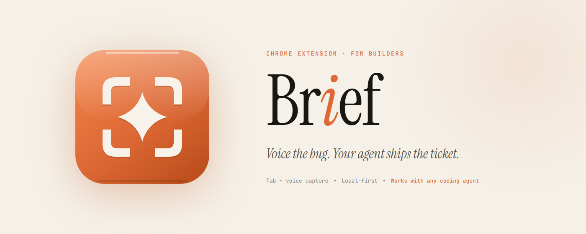
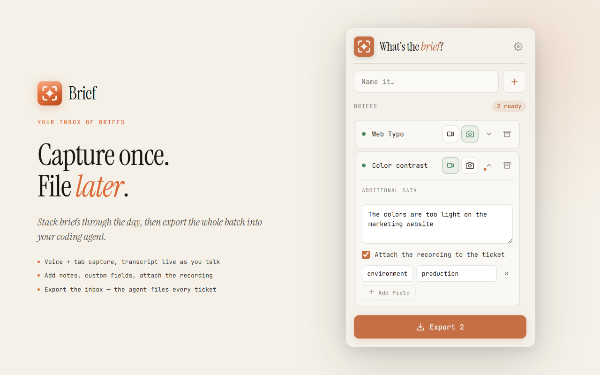

<div align="center">



<br><br>

**Half the bugs your team sees never get filed.** Writing a good ticket takes five minutes, so nobody bothers. Brief is a Chrome extension that captures voice + screen + logs in 30 seconds and hands the rest to your coding agent.

[**Install from Chrome Web Store →**](https://chromewebstore.google.com/detail/brief/dbceddgckljkggbghaddpclblfbkmfig) &nbsp; · &nbsp; [get-brief.app](https://get-brief.app)

</div>

---

## The loop

1. **Record.** Hit ✦, talk through the bug while it's on screen, stop.
2. **Export.** Copy the prompt, paste it into your coding agent.
3. **Ship.** Agent reads the brief, files the ticket in Linear / Jira / GitHub / Notion, deletes the source.

Capture as many as you like through the day — they queue in your inbox. Process them whenever.

Everything stays on your machine. No accounts, no upload, 100% local. MIT licensed.

<p align="center">
  
</p>

## What you need

- **Chrome** (or any Chromium browser: Edge, Brave, Arc)
- **A coding agent with file access and a tracker connected** — anything that can read local files and reach your tracker via an integration/MCP

Brief does the capturing; your agent does the filing.

## Brief vs. hand-written

|                | Brief        | By hand   |
|----------------|--------------|-----------|
| Time to write  | 20 seconds   | 5 minutes |
| Attachment     | ✓            | ✕         |
| Console logs   | ✓            | ✕         |
| Repro steps    | ✓            | ✕         |
| Follow-ups     | 0            | 3         |

---

<details>
<summary><b>Install unpacked (for the latest)</b></summary>

<br>

1. [Download the repo](https://github.com/razi2001/brief/archive/refs/heads/main.zip) and unzip it.
2. Open `chrome://extensions`, toggle **Developer mode**, click **Load unpacked**, pick the `extension/` folder.
3. Pin the ✦ icon to your toolbar.

First click on ✦ opens a permission tab to grant the mic, then a short "how it works" page.

**No skill to install separately.** Every brief is a self-contained zip — the filing playbook (`skill/SKILL.md` + playbooks) ships inside it. Any local agent that can read files and reach your tracker can file the ticket.

</details>

<details>
<summary><b>How it works (under the hood)</b></summary>

<br>

```
┌──────────────────┐    ┌────────────────────┐    ┌──────────────────┐
│  Chrome ext      │ →  │  ~/Downloads/      │ →  │  Your agent      │
│  records tab +   │    │  brief/            │    │  reads brief.json│
│  voice           │    │  brief-<id>.zip    │    │  files ticket    │
└──────────────────┘    └────────────────────┘    │  deletes brief   │
       click ✦              local zip              └──────────────────┘
```

A brief is a folder:

```
~/Downloads/brief/<id>/
├── brief.json              ← transcript, time-stamped chunks, events, console errors
├── recording.webm          ← original screen + voice
└── keyframes/
    ├── keyframe-000.png    ← sampled every 2s
    └── …
```

When your agent processes briefs, it:

- Binary-searches keyframes (reads 3-5 strategic frames, not all 20+)
- Maps your spoken words to the frames you said them on (±2s)
- Picks the right Linear team / GitHub repo / Notion DB **without asking you**
- Embeds keyframes inline as markdown images
- Attaches the recording only when it beats the keyframes (motion, timing, multi-step bugs)
- Includes console errors verbatim
- **Deletes the brief once the ticket is confirmed filed**

</details>

<details>
<summary><b>Voice quality, honestly</b></summary>

<br>

Brief uses Chrome's built-in speech recognition (`webkitSpeechRecognition`). Free and local, but:

- One language per session — pick English or French on the bar; **no auto-switch**.
- Accents, code, and jargon are mediocre.
- The skill knows this. It tells the agent to treat the transcript as a draft and use keyframes + events as ground truth.

Whisper support may land in a future release.

</details>

<details>
<summary><b>Privacy</b></summary>

<br>

- Recording happens in your browser. The video never uploads.
- Your mic audio passes through Google's speech-recognition service while transcribing (that's `webkitSpeechRecognition`, not us). Not stored.
- Console-error capture runs only while recording, only on that tab, only forwards error messages — no DOM, no cookies, no storage.
- Briefs are local. They never leave your machine unless your agent reads them.

</details>

<details>
<summary><b>FAQ</b></summary>

<br>

**Which coding agents work?**
Any local agent with file access and a tracker integration. The filing skill ships inside each brief.

**Does it work on `chrome://` pages?**
No. Chrome blocks tab capture on its own pages.

**Firefox / Safari?**
Chromium browsers only for now.

**Where do briefs live?**
- macOS / Linux: `~/Downloads/brief/`
- Windows: `%USERPROFILE%\Downloads\brief\`

**Can I share a brief with a teammate?**
Yes — the zip includes the skill. They unzip it, point any local agent at `skill/SKILL.md`, and it'll file the ticket on their machine.

</details>

<details>
<summary><b>Updating & uninstall</b></summary>

<br>

**Updating.** Pull the latest repo and reload the unpacked extension at `chrome://extensions`. New briefs bundle the newest skill automatically. (Web Store installs update on their own.)

**Uninstall.** Remove the extension at `chrome://extensions`. Your briefs in `~/Downloads/brief/` stay put — delete the folder yourself if you want them gone.

</details>

---

MIT — see [LICENSE](LICENSE).
